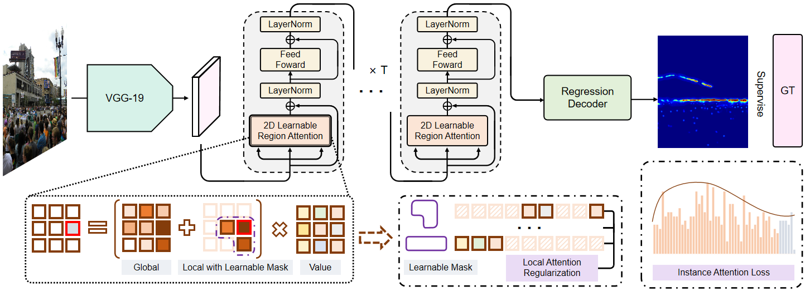

# Boosting-Crowd-Counting-via-Multifaceted-Attention
Official Implement of CVPR 2022 paper 'Boosting Crowd Counting via Multifaceted Attention'

This version replaces the VGG19 backbone with an ImageNet-pretrained
Swin-T backbone. The Swin stage-4 feature is projected from 768 to 512
channels and passed to the original multibatch MAN encoder and density
regression head. CCST/TransCrowd heads, losses, and weakly-supervised
training strategies are not used.

[arxiv](https://arxiv.org/pdf/2203.02636.pdf) | [知乎](https://zhuanlan.zhihu.com/p/478023612) | [B站](https://www.bilibili.com/video/BV13Y411u7r5?share_source=copy_web)



## Train
1. Install dependencies with `pip install -r requirements.txt`.
2. Dowload Dataset JHU++ or UCF-QNRF.
3. Preprocess them with `preprocess_dataset_jhu.py` or `preprocess_dataset_ucf.py`.
4. Run `python train.py --data-dir <dataset-root> --batch-size 2`.
5. Wait patiently for the program to finish.
6. Then you will get a good counting model!

The ImageNet-1K Swin-T weights are downloaded automatically for a new
training run. Pass `--no-pretrained-backbone` to disable this. Old VGG19
checkpoints are not compatible with the Swin-T model.

Training and validation progress are displayed with tqdm. TensorBoard scalar
logs are stored in `model/<run>/tensorboard/` and can be viewed with:

```
tensorboard --logdir model
```

Epoch numbers shown in logs, progress bars, TensorBoard, and checkpoint names
are 1-based. For example, `--max-epoch 10 --val-start 5 --val-epoch 5`
trains epochs 1 through 10 and validates at epochs 5 and 10.


## Test
1. Dowload Dataset JHU++ or UCF-QNRF.
2. Preprocess them by 'preprocess_dataset.py' or 'preprocess_dataset_ucf.py'.
3. Provide a checkpoint trained with the Swin-T model.
4. Run `python test.py --data-dir <dataset-root> --save-dir <checkpoint.pth>`.


## Citation
If you use this code for your research, please cite our paper:

```
@inproceedings{lin2022boosting,
  title={Boosting Crowd Counting via Multifaceted Attention},
  author={Lin, Hui and Ma, Zhiheng and Ji, Rongrong and Wang, Yaowei and Hong, Xiaopeng},
  booktitle={CVPR},
  year={2022}
}
```
